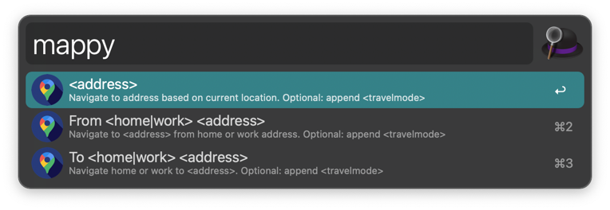

# Mappy - Google Maps Navigation Workflow for Alfred

[](https://github.com/AdrianBartnik)
[](https://www.python.org/downloads/macos/)

This Alfred Workflow makes it easy to quickly access the Google Maps Navigation.
It either works with a simple address search or by combining `from` & `to` based on your pre-defined home or work address.

https://github.com/adrianbartnik/AlfredGoogleMapsNavigationWorkflow/assets/3998715/abfaa653-c147-43f7-b9e0-720867aa3288

## Installation

* Ensure you have Alfred installed with the [Alfred Powerpack](https://www.alfredapp.com/powerpack/) :warning:
* Download the [Google Maps Navigation Workflow File](https://github.com/adrianbartnik/AlfredGoogleMapsNavigationWorkflow/releases/latest). 
* Open the workflow file to import it into Alfred
* Set up the workflow configuration parameters (see below for additional details) or by clicking the little [X] in the top right hand of the Workflow page in Alfred after installation



## Usage

You can use the `mappy` keyword to invoke this workflow from Alfred.
It provides two main features: quick access based on your current location or based on pre-configured home/work addresses.
In addition, a default transportation mode can be set or set per search.

### Default Address Search based on your current location

This opens the default Google Navigation with the address query as destination and your location as origin.
The address query will be directly used as input for the Google Search. 

```shell
mappy <your address query>

Example: mappy New York, Times Square
```

### Navigation to / from your home / work address

This opens the default Google Navigation with the home/work address and the address query as origin/destination respectively.
The home and work address need to be configured, see below.

```shell
mappy [to|from] [home|work] <your address query>

Examples:
- mappy to home Eiffel tower
- mappy from work Brandenburger Gate
```

### Transportation mode

You can configure a default transportation mode (car, walking, bike, public transport) for each search.
In addition, you can also configure the transportation per search by appending it to the commands above, e.g.:

```shell
mappy <your address query> <transportation mode>

Examples:
- mappy to home Big Ben, London walking
- mappy from work Hardenbergpl. 8, 10787 Berlin bike
```

A description of the different transportation modes can be found in the [Google Documentation](https://developers.google.com/maps/documentation/urls/get-started).
The latest list of valid transportation modes can be looked up in [lines 24 of the `google-maps.py` file](google-maps.py).

| Transportation Mode | Description                            | Alternative Keys                  |
| ------------------- | -------------------------------------- | --------------------------------- |
| driving             | Car transportation                     | `["car", "drive", "driving"]`     |
| bicycling           | Bike travel                            | `["bike", "cycle", "bicycling"]`  |
| transit             | Public Transport                       | `["public", "transit", "train"]`  |
| walking             | Walking                                | `["walk", "walking"]`             |
| default             | Automatically choosing the best option | `["default", "best", "adaptive"]` |


## Configuration

During installation and in the workflow configuration, you have the possibility to set:

* Your home address
* Your work address
* Your default mode of transportation
* The default Google domain

## Development

This project is built with Python 3.9 and Poetry.
To get started, run `poetry install`.

### Linting

We use `flake8` and `black` to lint our code.
Run the following to lint the code:

```shell
poetry run pflake8 .
poetry run black .
```

## Release Process

* Install workflow in Alfred
* Make code changes in IDE (e.g. Pycharm) and compy them over to the Alfred workflow working directory
* Test whether workflow changes work as expected
* Once verified, remove unneeded assets from workflow directory, e.g. [`demo.mp4`](./assets/demo.mp4) & [`screenshot.jpg`](./assets/screenshot.png)
* Export workflow file through Alfred and update the file in this repository
* Copy over other files, e.g. `Info.plist`
* Add entry to changelog in this `README.md`
* Commit and push the changes to Github
* Create new release in Github and manually attach updated workflow-file

## Changelog

### v1.0.1 - Address Workflow feedback from Alfred Forum

* Reduce workflow size by removing unneeded files (e.g. demo video and screenshot)
* Use `argv` instead of `{query}` in file filter
* Rename `default` `travel_mode` to `best` and set default value 

### v1.0.0 - Initial release

## License

* [Icon - Freepik from Flaticon](https://www.flaticon.com/de/kostenloses-icon/google-maps_2667975)